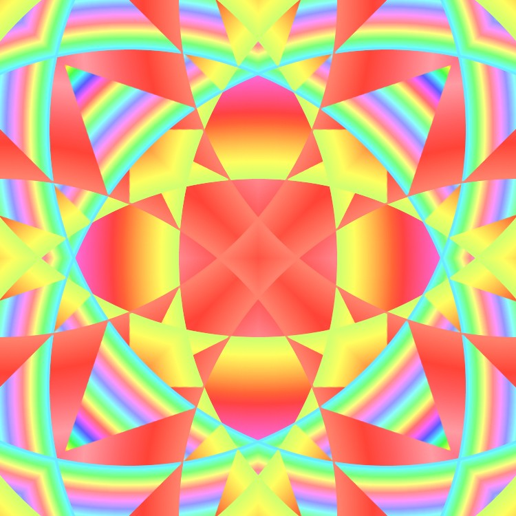
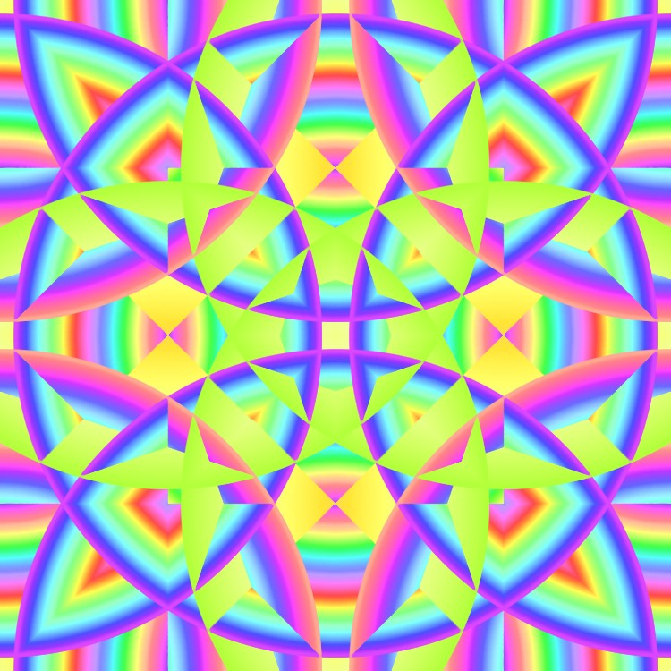
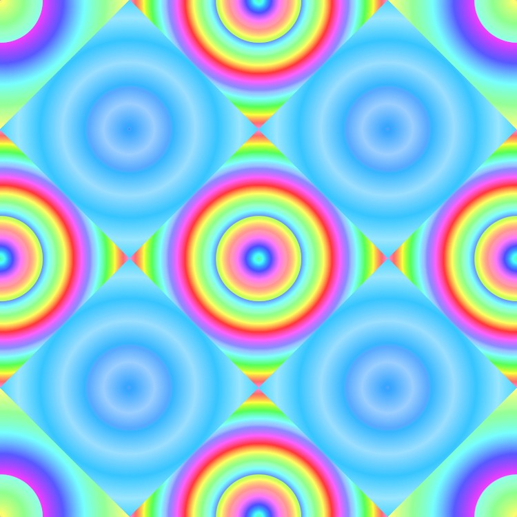
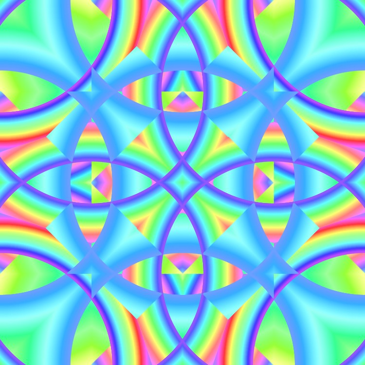
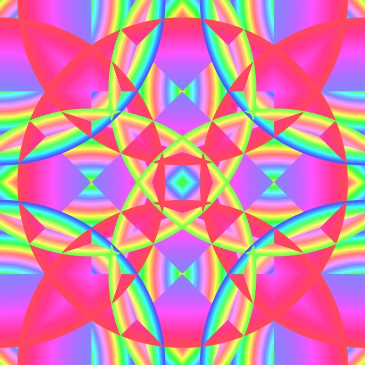
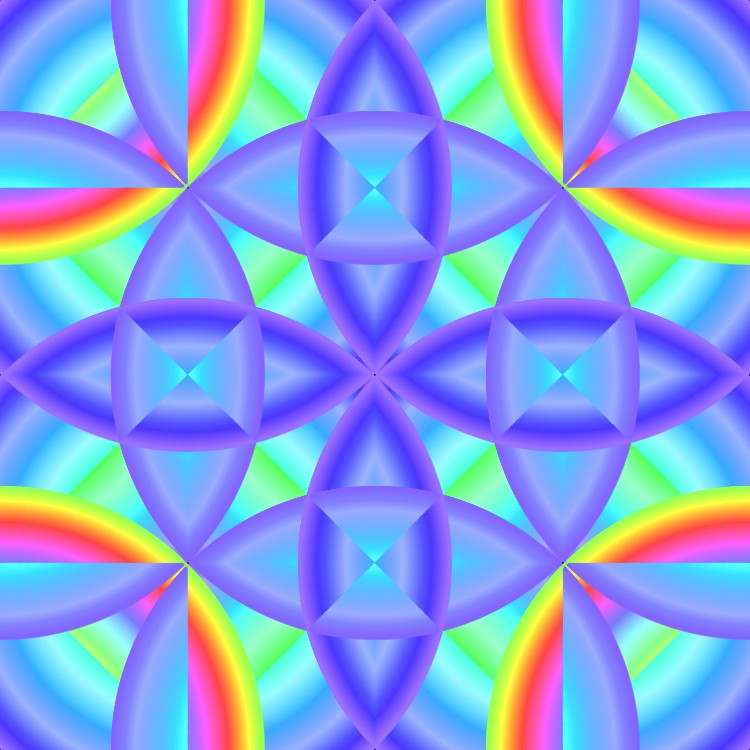
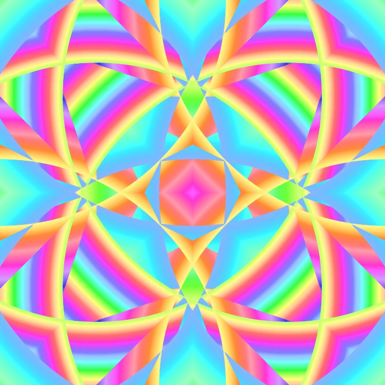

# Kaleidoscope
A python Processing generative art that creates an animation that resembles a kaleidoscope.    
Activity in CPAR 12

[YouTube video here](https://youtu.be/54g10RZAQus)

## Images

